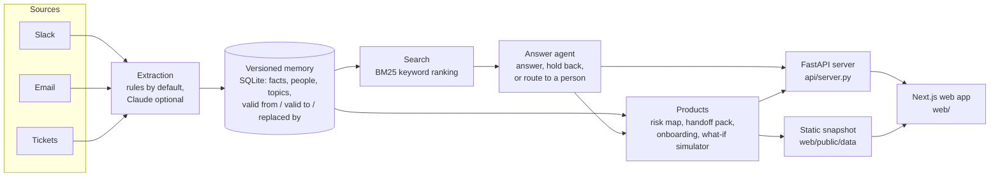
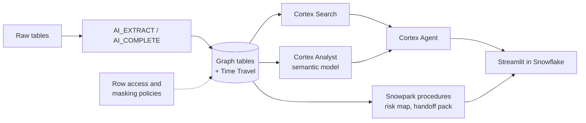

# Keepline

When someone leaves a company, what they knew often leaves with them. Their replacement usually starts after they are gone, so there is no overlap. And the one warning that mattered ("never rotate that key on a Friday") was written two years ago in an email nobody will find.

Keepline reads the messages a team already writes (Slack, email, tickets) and turns them into a company memory that keeps its history. Every fact records who said it, when it was true, and what replaced it. From that memory Keepline:

- shows which topics only one person really knows,
- writes a handoff pack that the person leaving reviews and signs off,
- briefs the new hire on day one,
- answers questions with links to the original messages, or says "I don't know, ask Mike" when it has no proof.

Live demo: https://keepline.vercel.app

The demo company is Harbourline Credit Union, which is made up. Sarah, who runs reconciliation, leaves on Sep 11. Alex, her replacement, starts on Sep 14.

## How it works



1. Extraction reads each message and pulls out statements of fact. Each fact keeps its receipt: the author, the date and a link to the source message. Direct messages are skipped by default.
2. The memory stores facts with dates. When a rule changes, the old version is kept and marked as replaced, so Keepline gives the current answer and can still show the history. This is what "versioned" means here.
3. A person is linked to a topic only through hands-on work (closed tickets, facts they stated), not job titles or message volume. A topic with one linked person is a risk. The risk score is `importance x (1 - redundancy) x departure likelihood`.
4. Search uses BM25, a standard keyword ranking method. The answer agent then decides whether to answer, hold back, or send the question to the person most likely to know, based on a confidence score.
5. The web app talks to the API when it runs locally. The hosted site uses a static snapshot of the same data, exported by `scripts/export_web_data.py`.

There is also a Snowflake version that runs the same pipeline inside a Snowflake account, so company data does not leave it.



## Tech stack

| Part | Technology | Where |
|---|---|---|
| Core engine | Python 3.12, NumPy, pandas | `keepline/` |
| Memory store | SQLite | `keepline/memory/` |
| Search | BM25, written in Python with NumPy | `keepline/retrieval/` |
| API | FastAPI, served with Uvicorn | `api/server.py` |
| Web app | Next.js 16, React 19, Tailwind CSS 4, React Flow, Recharts, react-force-graph | `web/` |
| Hosting | Vercel (static snapshot mode) | `web/` |
| Language model (optional) | Claude through the Anthropic API, for extraction and the chat assistant | `keepline/llm.py`, `keepline/agent/chat.py` |
| Data warehouse version | Snowflake: Cortex Search, Cortex Analyst, Cortex Agent, AI_EXTRACT / AI_COMPLETE, Snowpark, row access policies, Streamlit in Snowflake | `snowflake/`, `app/` |
| Tests | pytest, fully offline | `tests/` |

Claude is not required. Without an API key, extraction uses rules and the chat assistant uses a fixed set of intents. Every model call is cached on disk. Snowflake Cortex is only used when you ask for it (`KEEPLINE_LLM=cortex`), because it costs credits.

## Features

- Knowledge map. A graph of people and topics that marks where only one person knows something, and what changes if a given person leaves.
- Handoff pack. For a departing employee: what they know, with receipts, suggested new owners, and open questions. They review each item and sign off.
- Onboarding brief. For the new hire: who to ask, what was decided and why, and what not to touch. If the best person is leaving, it says who to ask after they go.
- History. How a rule changed over time, and who changed it.
- Ask. Answers with citations. If there is no evidence, it says so and names the person to ask. The chat assistant can only repeat what the cited messages say; any citation it makes that did not come from a tool result is dropped.
- What-if simulator. Describe a planned change (for example, "upgrade CoreLink next month"). Keepline finds the topics it touches, who knows them, and runs the project 2,000 times with random absences and known departures to estimate how often a topic ends up with nobody who knows it.

## Results

We wrote the company's answer key first (the truth file in `data/truth/`), then generated the messages from it. Keepline only sees the messages; `tests/test_isolation.py` fails if product code reads the answer key. Questions are split by fact, so test facts never appear in training. The test split is frozen by a hash (`data/questions/test.sha256`) and was run once.

Held-out test split, 216 questions (`data/results/benchmark_test.json`):

| Metric | Plain search | Keepline |
|---|---|---|
| Confidently wrong (of all 216) | 71.8% | 22.2% |
| Correct with a citation (137 answerable questions) | 35.8% | 43.1% |
| Routed to the right person (21 questions) | 12 of 21 | 21 of 21 |
| Calibration error (lower is better) | 0.269 | 0.053 |

Calibration error measures how far the stated confidence is from the actual hit rate.

Notes:

- Keepline is often right to hold back, but not always. On the test set it held back on 46 questions it could have answered.
- The learning part tunes the agent's decisions, not the language model. A confidence calibrator trained on the training split carried over well to the test split (0.27 to 0.05 above).
- A second method, a contextual bandit (a learner that picks answer / hold back / route thresholds from past rewards), beat the default on the dev split but not on the test split. It held back too often and scored a mean reward of -0.050 against -0.038 for the calibrated default. With 388 training questions it overfit. The shipped agent uses the calibrated default.
- All data is synthetic. These numbers show the method works on a realistic made-up company, not on real customer data.

## Run it locally

Requires Python 3.12+ and Node.js.

```bash
pip install -e ".[dev,llm,snowflake]" fastapi "uvicorn[standard]"

python -m keepline.data.build                 # answer key -> synthetic messages + frozen question splits
python -m keepline.memory.build --llm none    # messages -> memory graph and search index (data/memory/)
python -m uvicorn api.server:app --port 8000  # JSON API

cd web && npm install && npm run dev          # http://localhost:3000
```

If the API is not running, the web app falls back to the snapshot in `web/public/data/`. Set `NEXT_PUBLIC_KEEPLINE_API=off` to always use the snapshot (this is how the Vercel site runs). After changing data, refresh the snapshot with `python scripts/export_web_data.py`.

Other commands:

```bash
pytest -q                                          # full test suite, offline, no model calls
python -m keepline.eval.benchmark --split dev      # benchmark on the dev split
python -m keepline.eval.robustness                 # accuracy as the messages get noisier
streamlit run app/Home.py                          # Streamlit version of the app
python snowflake/deploy.py --dry-run               # show what the Snowflake deploy would run
```

To use Claude, set `ANTHROPIC_API_KEY` and build with `--llm auto`. Snowflake credentials (`SNOWFLAKE_ACCOUNT`, `SNOWFLAKE_USER`, and `SNOWFLAKE_PRIVATE_KEY_PATH` or `SNOWFLAKE_PASSWORD`) go in a `.env` file at the repo root, which is gitignored. The first full deploy (`python snowflake/deploy.py`) needs the `ACCOUNTADMIN` role because it creates roles, a warehouse and the database.

## Repo layout

```
keepline/
  data/        answer key, message generator, noise
  memory/      extraction, versioning, expertise (SQLite)
  retrieval/   BM25 search
  agent/       answer agent and chat assistant
  products/    risk, handoff, onboarding, gaps, what-if, decision check, staffing
  rl/          rewards, calibrator, bandit
  eval/        grader, baseline, benchmark, robustness
api/           FastAPI server
web/           Next.js app (deployed to Vercel)
app/           Streamlit app
snowflake/     SQL, deploy script, Cortex Agent and Analyst specs
scripts/       snapshot export, demo data
tests/         pytest suite
data/          synthetic corpus, answer key, question splits, results
```

## Data

Everything in `data/` is synthetic. Harbourline Credit Union, its staff and its messages were generated for this project. No real company or personal data is used.

Built for Hack Atlantic 2026.
